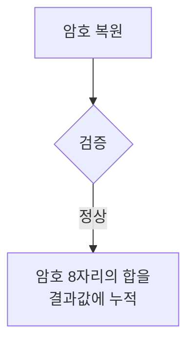
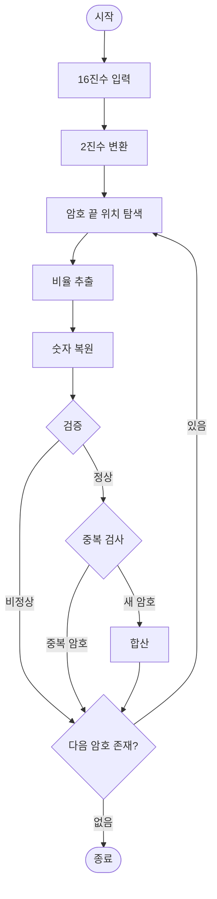

#### 시간복잡도 `O(NM)`

> 
>    Checkpoint : 알고리즘보다 어떤 자료형을 가지고 어떻게 처리할건지가 더 중요한 문제로 보임. 구현은 설명을 읽으면서 uml을 그리면 좀 더 수월할 것
>   
>   
>   hex(16진수)를 입력받아올때 string으로 입력받으면 아스키 처리를 꼭 해야함. 잊지말 것

<br>

문제를 해석하면 아래와 같음.

<br>

근데 이 암호는 **16진수**로 이루어져있고 주변에 쓸데없이 0으로 감싸놓음<br>
16진수 한자리 = **2진수 4자리**

#### 암호 하나짜리 테스트 케이스
```
00000000000000000000000000
00000000000000000000000000
000000001DB176C588D26EC000
000000001DB176C588D26EC000
000000001DB176C588D26EC000
000000001DB176C588D26EC000
000000001DB176C588D26EC000
000000001DB176C588D26EC000
000000001DB176C588D26EC000
000000001DB176C588D26EC000
000000001DB176C588D26EC000
000000001DB176C588D26EC000
000000001DB176C588D26EC000
000000001DB176C588D26EC000
00000000000000000000000000
00000000000000000000000000
```

0은 다 빼고 16진수만 받아오고싶지만, 방법을 잘 모르겠음.<br>
가장 간단한 구현은 **string으로 받아와서 전부 2진수로 바꿔**버리는 것<br>
string -> 아스키 입력이니, <br> 아스키 -> hex 변경(16진수) -> bin(2진수) 변경

<br>
입력이 해결됬다면, 이제 입력받은 값으로 어떻게 탐색할 지가 문제.


그림[1]을 보면 오른쪽 끝은 항상 1로 되어있다는 공통점이 있음
그래서 오른쪽 끝부터 탐색 함 <br>

```
int code[10][4] = {
	{3, 2, 1, 1}, // 0
	{2, 2, 2, 1}, // 1
	{2, 1, 2, 2}, // 2
	{1, 4, 1, 1}, // 3
	{1, 1, 3, 2}, // 4
	{1, 2, 3, 1}, // 5
	{1, 1, 1, 4}, // 6
	{1, 3, 1, 2}, // 7
	{1, 2, 1, 3}, // 8
	{3, 1, 1, 2}  // 9
};
```
그림[1]의 비율을 상수로 만들어두면 set으로 비교할 때 편함.<br>
1과 0의 비울을 보고 숫자를 판단하니까 헷갈릴게 분명한 뒤에 0부분은 과감하게 날림 == 
 `code[n][0]` 탐색 제외


이거를 수더코드로 보면

```
string binary = n번째 줄 2진수 변환값 저장
int number[8]
idx = binary.len -1
while(idx >=0 ) {
    //0 다 빼내고 다음으로 넘김
    while(binary[idx] == '0') idx--
    
    for(int : range(0,8)){
        //첫번째 1 코드비율확인을 위한 카운트
        int cnt=0, code3Idx=0
        while(binary[idx] == '1') idx--, cnt++
        code3Idx = cnt;

        //0 코드 비율을 확인을 위한 카운트
        int cnt=0, code2Idx=0
        while(binary[idx] == '0') idx--, cnt++
        code2Idx = cnt;

        //두번째 1 코드비율확인을 위한 카운트
        int cnt=0, code1Idx=0
        while(binary[idx] == '1') idx--, cnt++
        code1Idx = cnt;

        //비율 계산, 가장 작은 값을 기준으로 나눈다
        ratio = min(code1, code2, code3)

        code1, code2, code3 /= ratio

        if(code1, code2, code3 == code[n][1], code[n][2], code[n][3])
            number[i] = n
        
        //번호 하나 찾았으면 다음 1을 위해 숫자 빼기
        while(binary[idx] == '0') idx--
        
    }
}

    
```

포인트는 `while(binary[idx] == '0') idx--` 뒤에 암호가 더 있을 때를 대비해서
0을 빼두는것.

이 과정을 거치고 나서 `number[8]`를 가지고<br>
>  “(홀수 자리의 합 x 3) + 짝수 자리의 합 + 검증 코드” == 10의 배수
일 때, 정상적인 암호코드니까 해당코드번호의 합을 출력
아니면 0 출력의 과정을 거침


#### 최종 과정




---
후기: bitset ,set, array같은 경우 거의 써보지 않았어서 헤맴. 자료구조 다시 공부 할 것.<br>
해시 set인 unorder_set을 썼으면 좋았겠지만, `unorder_set<array<int, 8>>`이게 안먹힐 수 있다고 함.<br> 배열을 안쓰면 가능하긴 함. 대신에 number[]를 숫자로 바꿔줘야함 당장 봤을 땐 직관적이진 않지만 속도는 이쪽이 더 빠름.

스트링 겹겹이 값 줄거면 미리 재할당하자